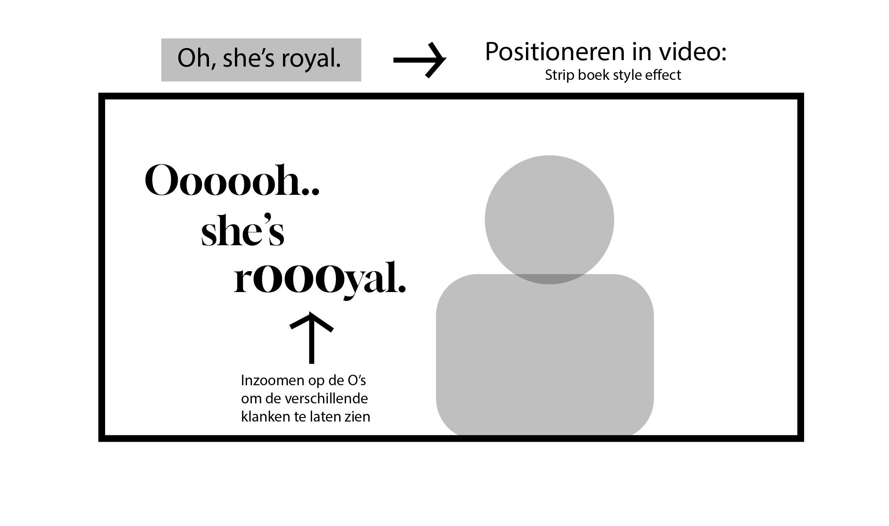

# Creative Captioning, Bitch!
Dit is een repo voor de individuele opdracht voor het vak Human Centered Design.

## The assignment
**⭐️ Marie van Driessche ⭐️** 

Marie is docent bij CMD en ze werkt als ontwerper bij Unc Inc. Marie is doof (en zo geboren) en wil graag naar podcasts luisteren en daar net zoveel details in horen als mensen die kunnen horen. En ze wil graag dat ze geluid in films net zo kan ervaren als mensen die wel geluid horen.

Ze houdt niet heel erg van podcasts omdat ze saai en niet toegankelijk zijn. Ze staat er niet echt op te wachten om naar 2 mensen op de bank die met elkaar praten te kijken. Films zijn voor haar veel boeiender (meer visueel), maar heeft meestal dat er bij de captions dat geluiden bijvoorbeeld niet uitgebreid genoeg is beschreven. Maar ze wilt dan niet dat ze opeens een hele lap tekst gaat lezen, dan moet het heel erg interessant zijn. Het hangt dan weer af van hoeveel tijd en aandacht ze daaraan wilt besteden.

De series waar naar ze kijkt:
- The Bake Off
- 3 Body Problem 
- The Bear
- The Menu
- Rupaul's Drag Race
- The Chestnut Man

Ondertiteling is voor haar heel erg twee dimensionaal, en volgend haar is geluid veel meer dan dat. Iets wat shockerend of grappig is, of bepaalde stem tonen kan je in de ondertiteling niet echt zien.

Geluid is voor haar heel abstract. Ze heeft een gehoorapparaat en met dat hoort ze wel'iets' maar ze heeft geen idee van muziek en wat dat eigenlijk is. Dingen zoals spannende muziek, wat is dat? Wat maakt het spannend? Dit is waar ze heel erg benieuwd naar is.


## Wat is Closed Captioning?
Closed captioning (gesloten ondertiteling) en subtitling (ondertiteling) is dus een manier van spraak tekst op een televisie, video, of ander visuele display om extra of toegevoegde informatie te laten zien voor meer context. Beide worden gemaakt met transcriptie van de opgenomen audio.

HTML5 beschrijft subtitles als een transcriptie of vertaling van de dialoog wanneer geluid aanwezig is maar niet begrepen is door de gebruiker (bijv, dialoog in een ander taal). Maar ze kunnen ook gebruikt worden als je bijvoorbeeld in een gehorig ruimte zit, of als je gewoon je koptelefooon bent vergeten in de trein. 

Bij closed captions is het een ander verhaal: Captions worden beschreven als een transcriptie of vertaling van de dialoog, geluidseffecten, relevante music cues, en dergelijke informatie in audio wanneer geluid niet duidelijk genoeg of geheel afwezig is (bijv. als de gebruiker op mute staat, of als de gebruiker doof of slechthorend is.). Deze captions worden meestal aangegeven met het CC symbool onderaan de video en kan handmatig worden aan of uitgezet.

## Week 1 

### User Trip
Ik was meer benieuwd om hoe dit zou zitten met reality achtige shows zoals RuPaul's Drag Race. Bij RuPaul's Drag Race heb je veel sensatie, drama en vooral de optredens met veel geluid en muziek en waarbij er veel gebeurd (en hetzelfde met The British Bake Off), dus ben ik begonnen met het kijken van een paar stukken van deze series om dit te testen.

Rupaul's Drag Race: S12:A7 - Madonna: The Unauthorized Rusical
Vanaf begin 25:40, 6 min lang

**Closed Captioning, geen geluid**

Sommige smoties zoals verrassing en in shock zijn zijn niet heel erg goed overgebracht, zie je eigenlijk nauwelijks. Alleen emoties met lachen zie je dus met een [laugh] stukje. Bij de optredens zag ik dat de drag queen zingt en de caption een noot heeft om aan te tonen dat ze zingt met emotie maar het is niet heel erg duidelijk genoeg. Ze gebruikt ook instrumenten in haar optreden, misschien kan het geluid wat aantoonbaar gemaakt worden met visuele animaties (idee!).

**Closed Captioning, met geluid**
- Er gebeuren zoveel achtergrond geluiden zoals gelach, dat helemaal niet te zien is in de closed captioning. Dit kan volgens mij wel wat verbeterd worden met wat animaties die bijvoorbeeld buiten de video staan, of ergens anders.


### Test 1: Rupaul's Drag Race ⭐️

Ik had mijn idee laten zien omdat ik niet op tijd was met een prototype maken door mijn afwezigheid. 

#### Feedback van Marie: 
Leuke idee en hieruit kan je veel emoties en persoonlijkheid tonen met de verschillende drag queens. De effecten met de voetstappen is een goed idee om dat te laten zien. Ook kan ik bijvoorbeeld de context van de gesprekken en bepaalde woorden laten zien. Ze is benieuwd of ik veel overdreven effecten zoals in stripboeken en anime strips kan toevoegen in de vorm van animaties (visual cues, "onomatopoeia").

### Vragen
Ik had wat vragen voor haar gesteld op basis van mijn concept, omdat ik net niet op tijd was om een prototype te maken en te laten zien. 

1. Custom closed captioning: Is het storend als dit ergens anders voorkomt dan alleen midden-onderaan in de video? (storend als in te druk, te afleidend van de content dat word laten zien)

### Ideeen
Wat ik heb meegekregen van een aantal notities in mijn groepje is dat:

- Trillingen kan helpen met emoties overbrengen, alleen moet het niet teveel gebruikt worden en alleen bij echt prominente geluiden zoals schoten die worden gelost of een deur die hard wordt gesloten
- Heel visueel maken, mini animaties maken die in beeld komen
- Visuele typografische effecten proberen toe te voegen bij de closed captioning: Kleuren en filters bijvoorbeeld
- Effects in video of erbuiten, geluid die dus misschien binnenkomt laten zien van de buitenkant of geluid die wegvalt ook weg laten "vallen" uit het beeld en in het kader

### 1e Gesprek - Eric
Ik was er niet in de ochtend woensdag, dus heb ik mijn eerste ideeen met Eric besproken. Hij vond het wel een interessant concept, waarbij je echt all out kon gaan met add nonsense. Ik was hiermee een beetje bang voor, want teveel kan ook echt teveel zijn en afleidend werken, maar de show is eigenlijk wel heel erg extra, dus ik had dat als een uitgangspunt genomen om zoveel mogelijk gekke ideeen te testen voor de volgende keer.


## Week 2:

### Eerste ontwerpen
Ik heb HappyScribe gebruikt om de spraak in captions te veranderen en er zijn wel wat lange zinnen uit gekomen. Ik heb de keuze gemaakt om deze zinnen zo kort mogelijk te houden zodat ik de visual cues and sound effects het beste kan laten zien. Een voorbeeld ervan:

```
16
And then when I learned that I could make money being a performer, bitch, the game changed.
```

Naar: 

```
16
And then when I learned that I could make

17
money being a performer,

18
bitch,

19
the game changed.
```

Hierbij kan ik makkelijker elk woord 'besturen' en ze een aparte effect geven die beter past bij het overbrengen van context. Dit heeft wat meer detail en is wat minder saai dan dat je een heel zin leest.



Ook heb ik voor de visual cues gifjes gemaakt in Procreate om de geluiden en sfeer te verduidelijken in een sketchbook achtige stijl. Als iemand bijvoorbeeld lacht, of schrikt, of gewoon simpele dingetjes (add nonsense) zoals rond draaien, dat je dat echt uit hun mond, of om hun lichaam kan zien dat het gebeurt.

Verder had ik als leuk idee dat ik effecten kon laten zien gebaseerd op de persoonlijkheden van de drag queens. Dit wil ik zo veel mogelijk visueel laten uitdrukken: ELke drag queen heeft dus een eigen intro met muziek, en andere houdingen, en probeer ik dit te toen met getimede achtergrondeffecten en te spelen met meerdere fonts per persoon.

### Wat kan ik uit testen?
 - Spans voor letters zodat ik elk letter kan animeren
 - Variable fonts om hiermee te animeren

### Wat heb ik verbeterd?
Ik kwam erachter dat het beter was om de timing van de animaties preciezer te maken met currentTime in de video ipv highlightedIndex. Omdat je met currentTime direct de secondes kan selecteren, kan ik ook precies een animatie laten afspelen en stoppen waar ik wil, met highlightIndex is dat lastiger want dat werkt met de caption times die ik heb in mijn captions.js. Een manier kan zijn om de secondes een beetje aan te passen maar dat kan risky zijn en de hele caption volgorde overhoop gooien.

### 2e Gesprek - Tamara en Vasilis
Ik was niet op tijd om een stukje van mijn idee te laten zien, dus heb ik mijn schetsen laten zien aan Tamara en Vasilis en uitgebeeld wat ik wilde maken. Ze vonden dit een leuk concept, en Tamara had een video laten zien (een Spaanstalig muziek video met leuke visuele effecten) als inspiratie van wat ik kon doen met de animaties. Voor nu was mijn concept alleen maar op papier, dus nu is het echt in code zetten en kijken wat de resultaat wordt.


## Week 3
### Testen met Marie
Ik had mijn concept aan Marie getest en ze vond het echt tof om te zien. Ze vond de kleuren en effecten in het algemeen top, en noemde vooral het laten zien van het achtergrond muziek met een party effect en duidelijke omschrijving een goede punt. Ze was tevreden over de nagedrukte teksten en de kleine visual cues, dat gaf meer detail over wat er precies gebeurde. Ze had wat feedback over wat kleinere dingen die ik opzettelijk heb gedaan voor testen, zoals:

 - De ondertiteling wat verder omhoog zetten (dit kwam ik erachter voor het testen, toen de grote monitor alles opeens had verschaald)
 - Het contrast van sommige woorden fixen
 - Video wat groter maken voor beter zicht

(contrast foto hier!)

Ik had vooraf ook een vraag aan haar gesteld:
 - 1. Is de beschrijving van de achtergrond geluiden duidelijk genoeg?
Dit heb ik gedaan omdat ik wilde testen met het uitgebreid beschrijven van het geluid wat er afspeelt, sinds ze een week geleden had aangekaart dat sommige beschrijvingen van geluid heel saai zijn of veelal wat informatie miste.
 
Ze was er tevreden mee zei dat het duidelijk genoeg was. Ik was blij om te zien dat ze het zo tof vond!

### 4e Gesprek - Eric
Ik had weer een gesprek met Eric en heb uitgelegd dat de tests heel goed ging en dat ik blij was dat ik de situatie goed had geobserveerd en gelijk een hele goede prototype kon neerzetten. Ik besprak ook wat ik later met Marie wilde testen:
- Focussen op de verschillende personages en de effecten
- UI en dingen fixen zoals kleine ondertiteling en video
- Meer nonsense: dingen uittesten en kijken of dat werkt
En als tenslotte ook nadenken over de 4 exclusive design principles en hoe dat heeft aangesloten op mn ontwerp.

## Week 4 
In de vierde week heb ik even weer gekeken naar wat ik meer leuke dingen kan toevoegen waar Marie lovend over was. Hierbij heb ik:
- Meer de focus gelegd om het verschil uit te drukken tussen de persoonlijkheden van de drag queens
- Inspiratie van Marie's recommendations: de kinetic typography voorbeeld van Pulp Fiction
- Add nonsense
- De feedback verwerken 

Ik heb de beslissing genomen om leuke en grappige lange zinnen op te breken in losse woorden om zo leuke typografische effecten toe te voegen.
Een voorbeeld hiervan die ik al had was Plasma's 'Oooooh, she's royal' zin, maar ook Geneva's intro: 'Viva Mexico.. Ca.. Brones!'

(geneva's intro foto)

### De derde test
Ik heb mijn bevindingen verwerkt en aan haar gepresenteerd voor het testen. Ook heb ik de caption font wat groter gemaakt omdat dat te klein was, de video groter gemaakt, en het contrast gefixt met Plasma's Oh she's royal lijn door een speech bubble eronder te leggen zodat het beter te lezen is. Ik heb bewust niet gekozen voor andere kleuren, omdat de show achtergrond zo kleurrijk is dat het contrast sowieso al slecht is en bijna alle kleuren erin kunnen 'verdwijnen'.

(contrast fix)

**Wat vond Marie belangrijk en leuk?**
- De coole effecten, animaties en lightshow zoals altijd :D
- Het feit dat ze het heel echt belangrijk vond dat ik de Spaanse woorden niet voor haar heb vertaald
- De expliciete woorden die bewust zijn ongecensureerd

**Wat had Marie als feedback punt?**
Als test had ik voor het onderscheiden van de verschillende drag queens, aanduideingen gemaakt op basis van de toon op wat ze zeggen. Ik heb een normale tekst gemaakt met spans en classes, met een lichtere kleur en lettertype dikte, om aan te duiden dat zij deze woorden met veel enthousiasme zeggen.
``` 
<p id="line-35">
		<span class="queenHershiiBold">Period! </span>
		<span class="queenHershii">This feels so </span>
		<span class="queenHershiiBold" id="shake">fucking </span>
		<span class="queenHershii" id="end">surreal.</span>
	</p>
```
Dus als voorbeeld: Als Plasma en Hershii enthousiast met elkaar praten, hebben ze elk 2 kleuren in hun caption line. Dit ziet Marie dus als 4 kleuren, en dan 4 personen, en vraagt ze dan zich af wie dat zeggen.

Ze vond dit wel apart, want zij ziet dit namelijk als 2 verschillende personen mede dankzij de 2 verschillende kleuren die er zijn. Ik vond dit interessant om te zien en hoe gewoon een beetje verschil met kleuren de context al kan verdraaien voor haar. Dus heb ik als eindresultaat dat ik de default font aan houd, want hierin ziet ze (en ik!) toch duidelijk wie wie is op basis van de font alleen. 


## Exclusive design principles ⭐️

### Study Situation
In de eerste week was ik niet aanwezig, en heb ik wat feedback gekregen van anderen over haar situatie. Dit hield in dat ik eigenlijk een beetje te laat was met het maken van een test prototype voor week 2 en kon ik eigenlijk alleen mijn idee presenteren aan haar. Ze was er enthousiast over, en was benieuwd naar het resultaat. Ik heb wel tijdens deze test heel goed geobserveerd bij het werk van anderen, maar ook vooral hoe ze reageerde op het werk. Op basis van deze observaties, ben ik erachter gekomen dat ze:

- De normale closed captions haar eigenlijk niet helpt, omdat er bij het muziek of geluid afspelen totaal of weinig context beschikbaar is
- Meestal er niet eens staat wie wat zegt (namen missen)
- Ze is het meestal niet gewend dat captions op een andere plaats staan dan onderin de video

Ik heb met deze informatie (en ook mijn User Trip) mijn concept gemaakt dat zoveel mogelijk aansluiten op de bevindingen. En het was een succes!

### Ignore conventions

Marie is van mening dat de captions niet goed genoeg zijn (en daar heeft ze helemaal gelijk in). De geluidsbeschrijvingen heeft weinig of geen context, en ze vind het frustrerend dat er bijvoorbeeld 2 mensen met elkaar praten en er niet staat wie wat zegt.
Het is daarom belangrijk voor haar om een beetje 'buiten boord' te gaan, soms regels moet negeren en andere en hele creatieve oplossingen te zoeken om deze problemen aan te pakken. Ik denk dat ik de vertaling hiervan naar mijn concept goed heb gedaan, door het zo visueel en creatief mogelijk te maken, en de context en andere geluiden waar ze niets van af weet zo veel mogelijk aan haar laten zien.

### Prioritise identity

Marie's identiteit is dat ze heel erg van de details is. Ze vind het tof en belangrijk om echt alles te weten wat er in de video gebeurt. Is er een achtergrond muziek, of zijn er geluiden die niet bij de captions staan? Bij closed captioning is het ook dat alle captions meestal onderin staat, en de zinnen best wel lang zijn. Door als een test de meerdere zinnen op te breken zodat het fijner leest en een paar woorden in de video te laten animeren, ben ik erachter gekomen dat ze dat heel erg tof vond en niet afleidend werkt. Dingen die ik observeerde van anderen is dat Marie dan de beschrijvingen van bepaalde geluiden en muziek soms veel context miste, en ik het eigenlijk gelijk al goed deed door de context zo uitgebreid maar kort mogelijk te schrijven.

Een voorbeeld hiervan is dat er achtergrondmuziek afspeelt in de vorm van [music playing].
Ik vond dat al gelijk al nergens opslaan, vooral omdat je hoort dat er meerdere vormen van muziek gaande is, dus heb ik voor Plasma's intro [joyful and bouncy 1950's music playing] geschreven, en voor Geneva, [lively and vibrant Mexican music playing].

Een ding die ik ook wilde laten zien is dat ze het HAAT dat mensen scheldwoorden censureren, en dat er woorden van een andere taal opeens wordt vertaald. Dit is frustrerend en ze wilt alles zwart op wit zien. In mijn video snippet heb ik dan toch de scheldwoorden gelaten zoals het is (en het zelfs een uitdrukkende animatie gegeven!), en de Spaanse vertaalde woorden zo gelaten.


### Add nonsense

Hierin heb ik al vanaf het begin van het project al op ingespeeld, op basis van Marie's series en podcasts voorkeuren. Ik ging bewust voor RuPaul's Drag Race, niet zozeer omdat het niet een ultra serieuze serie is, maar omdat deze show echt een heel chaotisch kleurrijke charme heeft waar je echt HEEEEL veel mee kan doen. Bij het kijken van de show zelf zonder geluid, heb ik al een beetje geschetst van hoe ik het 'nonsense' zou uitbeelden en ik heb hiervoor bewust voor het hele visuele animatie-achtige style gekozen, om achtergrond en plotselinge geluiden te weergeven zonder daarvoor tekst te gebruiken. Ook heb ik wat inspiratie van Marie gebruikt om wat 'kinetic typography' neer te zetten.


## Reflectie ⭐️

Ik vond dit echt een heel leuk project en ook gelijk een grote uitdaging. Dit project heeft mij snel laten zien dat niet iedereen is zoals hoe je zelf bent en dat zij heel anders naar andere dingen kijken dan hoe jij het gewend bent.

Ik had ook niet verwacht van Marie dat ze mijn prototype zo leuk zou vinden. Dit heeft mij het meeste motivatie gegeven om door te gaan en heeft me ook bewust gemaakt van hoe creative captioning zoals dit een groot verschil kan maken voor mensen die doof of slechthorend zijn. Het is ook wel balen om je opeens te realiseren dat in het algemeen hier geen aandacht wordt besteed.

Bij het showcasen van anderen hun werk vind ik het toch tof hoe er onderscheid is gemaakt van hun ontwerpen op basis van de serie of film die ze hebben gebruikt. Sommige hadden The Chestnut Man, wat een eng film is, sommigen hadden The Bear, wat heel fast paced is en ruzies heeft, en dan kwam ik met RuPaul's Drag Race, wat een super extra en kleurrijke sfeer geeft.

In het algemeen ben ik trots op mn werk en dat mijn werk een belangrijkke bijdrage heeft gemaakt voor doven en slechthorenden, en dat ik mezelf niet heb gelimiteerd om 'in the box' te blijven tijdens het ontwerpen.


## Sources
- [Mozilla Developer Network - Closed captioning](https://developer.mozilla.org/en-US/docs/Web/Media/Audio_and_video_delivery/Adding_captions_and_subtitles_to_HTML5_video)
- [Wikipedia - Closed Captioning](https://en.wikipedia.org/wiki/Closed_captioning)
- [Mozilla Developer Network - WebVTT API](https://developer.mozilla.org/en-US/docs/Web/API/WebVTT_API)
- [Mozilla Developer Network - <track> element](https://developer.mozilla.org/en-US/docs/Web/HTML/Element/track)
- [Gebruikte video: Drag Race Season 16 Episode 2 First Act 😍💄 RuPaul’s Drag Race](https://www.youtube.com/watch?v=k6RUW2RRj78)
- [HappyScribe voor het transcriberen van de captions in de video met behulp van AI](https://www.happyscribe.com)
- Vasilis' SRT naar Caption Times tool + Web Typography project source

### Marie's recommendations
- Kinetic Typography: [Pulp Fiction: What does Marsellus Wallace look like?](https://www.youtube.com/watch?v=aopg7JqbgMo&t=5s)
- [Pulp Fiction - Kinetic Typography](https://www.youtube.com/watch?v=wF8f8w6HPoo)

